# 第一章 初识智能体

## 1.1 什么是智能体

### 智能体的特性

自主规划、调用工具、解决复杂问题。

### 智能体的定义

智能体被定义为任何能够通过 **传感器（Sensors）** 感知其所处 **环境（Environment）** ，并**自主**地通过 **执行器（Actuators）** 采取 **行动（Action）** 以达成特定目标的实体。

### LLM驱动的智能体与传统智能体对比

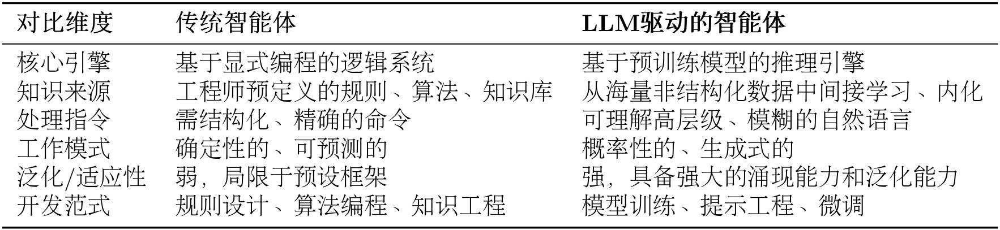

### 智能体的分类

内部决策架构分类：反应式->模型式->基于目标->基于效用式 --->学习型（性能元件+学习元件）

时间&反应性分类：反应式/规划式 ---> 混合式(规划->行动->观察，循环)

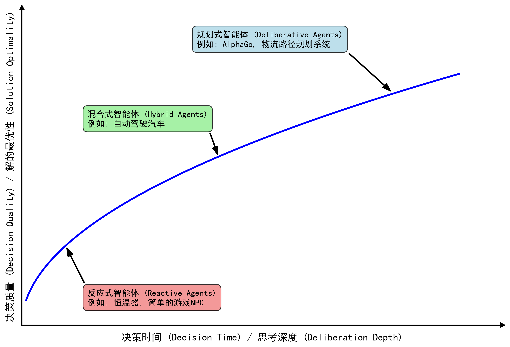

基于知识表示：符号主义/联结（亚符号）主义 ---> 神经符号主义（现在LLM驱动智能体，既能像神经网络一样从数据中学习，又能像符号系统一样进行逻辑推理）

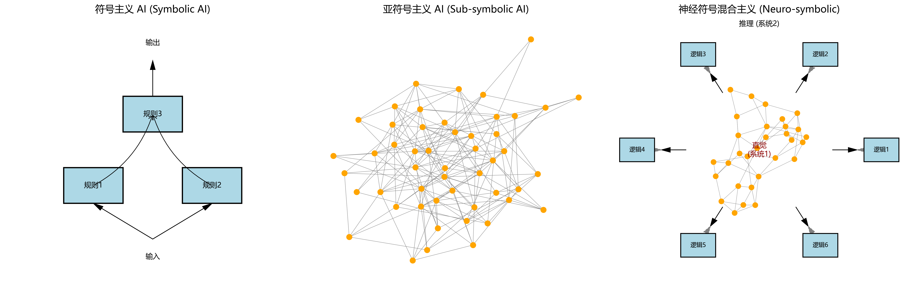

## 1.2 智能体的构成与运行原理

### 智能体的运行机制：智能体循环

感知->思考->行动->观察

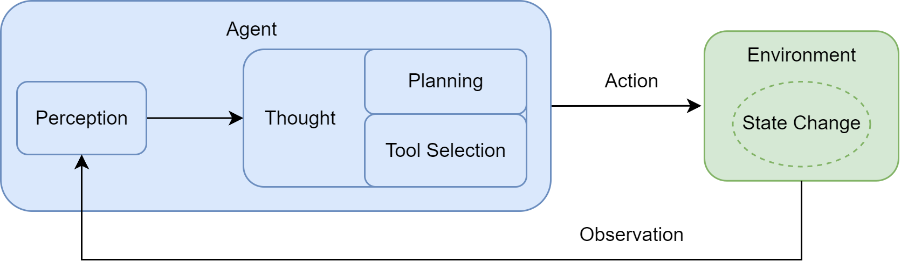

## 1.3 动手体验：5 分钟实现第一个智能体

使用Qwen3.5+modelscope完成。

## 1.4 智能体应用的协作模式

### workflow与agent的差异

work命令ai按部就班完成工作，agent授予llm自由度自主选择方法达成目标。

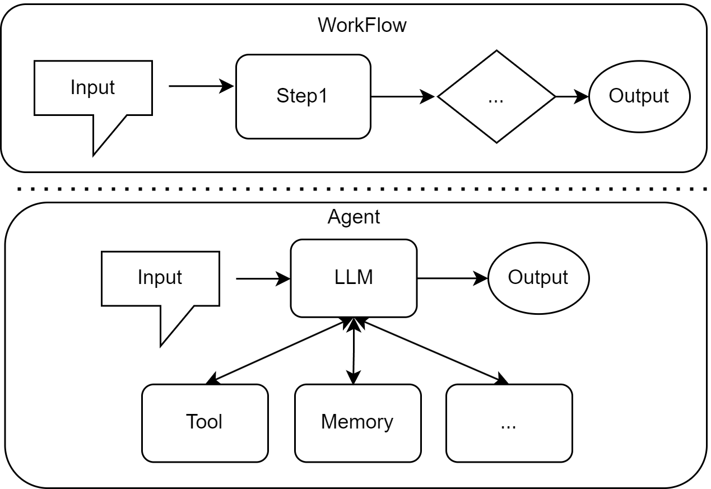

## 第一章习题

1. 请分析以下四个 `case` 中的**主体**是否属于智能体，如果是，那么属于哪种类型的智能体（可以从多个分类维度进行分析），并说明理由：
   `case A`： **一台符合冯·诺依曼结构的超级计算机** ，拥有高达每秒 2EFlop 的峰值算力
   `case B`：**特斯拉自动驾驶系统**在高速公路上行驶时，突然检测到前方有障碍物，需要在毫秒级做出刹车或变道决策
   `case C`：**AlphaGo**在与人类棋手对弈时，需要评估当前局面并规划未来数十步的最优策略
   `case D`：**ChatGPT 扮演的智能客服**在处理用户投诉时，需要查询订单信息、分析问题原因、提供解决方案并安抚用户情绪

   ```
   A 不是智能体，只是计算平台；题干未体现其通过传感器感知环境并通过执行器自主影响环境。
   B 是智能体。该系统可通过摄像头、雷达等传感器感知路况，并通过刹车、转向等执行器改变环境状态。从时间维度看，在避障场景下属于反应式；从内部架构看属于基于模型的智能体；从整体结构看又可视为混合式智能体。
   C 是智能体。其目标是赢得对局，因此属于基于目标的智能体；其需要评估未来多步后果，属于规划式智能体；同时它通过大量对弈学习策略，也属于学习型智能体。
   D 是智能体。它能接收用户输入、调用订单查询等工具，并生成解决方案作用于服务环境。从决策看，它需要综合用户满意度、规则约束和处理成本，具有基于效用的特征；从系统实现看，可视为混合式或神经符号式智能体。
   ```

   ```plaintext
   case A：不是。没有自主接收环境信息并使用动作影响环境的能力。
   Case B：是。若只看这个case中的场景，属于反应式/反射式/符号主义。智能体基于当前环境快速采取动作，并有明确的规则指引是刹车还是变道。驾驶系统本身则是模型式/混合式/神经符号主义。智能体建立了内部模型追踪和理解，内部有分层架构规划模块负责路径规划等，反应模块负责紧急情况处理，融合了符号主义决策（如红灯必须停车，根据指示牌调整限速）和亚符号主义决策（识别障碍物等）。
   Case C：是。属于基于目标/规划性/亚符号主义，也是学习型智能体。AlphaGo对于当前动作的决策基于获胜的目标，主动选择能导向某种未来状态的最佳行动，他使用深度学习策略学习对局经验，使用策略网络估计动作优劣。
   Case D：是。属于基于效用/混合式/神经符号主义。智能客服既要考虑商家列润，也要安抚用户情绪，需要对用户输入进行及时反应，也要规划完整的解决方案，融合符号主义决策（根据订单信息和规则逻辑推导可以提供的方案）和亚符号主义决策（从自然语言抽象出用户诉求和订单情况）。
   ```
2. 假设你需要为一个"智能健身教练"设计任务环境。这个智能体能够：

   * 通过可穿戴设备监测用户的心率、运动强度等生理数据
   * 根据用户的健身目标（减脂/增肌/提升耐力）动态调整训练计划
   * 在用户运动过程中提供实时语音指导和动作纠正
   * 评估训练效果并给出饮食建议

   请使用 PEAS 模型完整描述这个智能体的任务环境，并分析该环境具有哪些特性（如部分可观察、随机性、动态性等）。

   ```
   P：提高训练目标达成率、安全性、动作规范性、计划个性化程度和用户满意度。
   E：用户身体状态、运动场景、健身器械、饮食环境、历史训练记录、可穿戴设备与摄像头数据源。
   A：语音指导、动作纠正提示、训练计划调整、饮食建议推送、风险预警。
   S：心率/血氧/步频等生理数据，摄像头动作数据，用户语言反馈，历史训练与体测数据。
   环境特性：部分可观察、随机、动态、序贯、连续，且部分环节具有实时性要求。
   ```

   ```markdown
   Performance性能度量:在合理算力和时间内，最大化用户满意度和训练计划合理性、指导规范性、评估准确性和饮食建议合理性
   Environment环境:可穿戴设备的生理数据API服务、用户健身目标
   Actuators执行器:调用API服务，给用户输出语音、格式化文本或视频和图片
   Sensors传感器：解析API返回数据、读取用户输入的健身目标自然语言

   环境是部分可观察的；具有随机性，用户的要求和反馈不一定每次都一致；具有动态性，用户的生理数据不停变化。
   ```
3. 某电商公司正在考虑两种方案来处理售后退款申请：
   方案 A（`Workflow`）：设计一套固定流程，例如：
   A.1 对于一般商品且在 7 天之内，金额 `< 100RMB` 自动通过；`100-500RMB `由客服审核；`>500RMB` 需主管审批；而特殊商品（如定制品）一律拒绝退款
   A.2 对于超过 7 天的商品，无论金额，只能由客服审核或主管审批；
   方案 B（`Agent`）：搭建一个智能体系统，让它理解退款政策、分析用户历史行为、评估商品状况，并自主决策是否批准退款
   请分析：

   * 这两种方案各自的优缺点是什么？
   * 在什么情况下 `Workflow` 更合适？什么情况下 `Agent` 更有优势？如果你是该电商公司的负责人，你更倾向于采用哪种方案？
   * 是否存在一个方案 C，能够结合两种方案，达到扬长避短的效果？

     ```plaintext
     Workflow 更合适：
     	•	政策稳定
     	•	审核逻辑清晰
     	•	合规要求高
     	•	高频、低风险、标准化场景
     Agent 更有优势：
     	•	情况复杂
     	•	需要融合历史行为、商品状态、上下文证据
     	•	需要处理非结构化描述
     	•	规则经常变化
     负责人选择：
     	•	选方案 C：Workflow 为主，Agent 为辅
     	•	低风险标准单自动流转
     	•	高风险或模糊案件交给 Agent 辅助判断
     	•	最终关键节点人工审批
     ```

     ```plaintext
     (1)
     workflow：
     优点：行动可预测；对于<100RMB和特殊商品反应迅速
     缺点：大量商品无法自主处理
     agent：
     优点：自主性强，所有商品均可处理；可以感知用户历史行为进行决策；
     缺点：行动不可预测，对于不同用户可能有不同表现，商业风险；用户可能攻击agent进行不当退款；在某些商品可能反应较慢。

     （2）
     workflow：大量商品属于一般商品且金额较小，比如小工艺品、小型软件等；或是大量明确不支持退款的产品（订制品、电子产品等）
     agent：支持超过7天退货的商品；大量金额超过100RMB的商品；有“多次恶意退款可以不进行退款"规则的环境。
     大量廉价小商品或者减少合规成本角度，使用workflow；从节省人力资源成本角度讲，使用agent。

     （3）
     变成混合式agent，7天内小金额自动退款，其他情况使用agent自动分析退款，也可以agent给出处理建议，人工复核。
     ```
4. 在 1.3 节的智能旅行助手基础上，请思考如何添加以下功能（可以只描述设计思路，也可以进一步尝试代码实现）：

   > **提示** ：思考如何修改 `Thought-Action-Observation` 循环来实现这些功能。
   >

   * 添加一个"记忆"功能，让智能体记住用户的偏好（如喜欢历史文化景点、预算范围等）
   * 当推荐的景点门票已售罄时，智能体能够自动推荐备选方案
   * 如果用户连续拒绝了 3 个推荐，智能体能够反思并调整推荐策略

     ```plaintext
     记忆模块
     	•	新增 memory store，保存预算、偏好类型、出行限制等
     	•	每轮构造 prompt 时，注入 memory 摘要
     备选推荐模块
     	•	get_attraction_candidates(city, preference, budget)
     	•	get_ticketinfo(attractions)
     	•	在 Observation 后过滤售罄项并排序
     反思模块
     	•	维护 reject_count
     	•	连续 3 次拒绝时，触发 reflect_on_rejections()
     	•	反思后更新偏好或推荐策略
     ```

     ```plaintext
     （1）
     修改AGENT_SYSTEM_PROMPT：添加“若用户输入了偏好，需要在推荐景点时满足偏好”
     修建Action：get_attraction()添加参数preference:str
     （2）
     修改AGENT_SYSTEM_PROMPT：添加“需要查询推荐景点的门票情况，若门票已售罄，重新搜索景点”
     添加Action：get_ticketinfo(attraction: []str),查询一个或多个景点的门票信息
     （3）
     修改AGENT_SYSTEM_PROMPT：添加“若用户拒绝推荐，重新搜索景点；若用户三次拒绝推荐，询问用户拒绝原因并且根据拒绝原因更新用户偏好，重新搜索”；添加“景点推荐完成后，需询问用户是否接受推荐”
     ```
5. 卡尼曼的"系统 1"（快速直觉）和"系统 2"（慢速推理）理论 ^[2]^ 为神经符号主义 AI 提供了很好的类比。请首先构思一个具体的智能体的落地应用场景，然后说明场景中的：

   > **提示** ：医疗诊断助手、法律咨询机器人、金融风控系统等都是常见的应用场景
   >

   * 哪些任务应该由"系统 1"处理？
   * 哪些任务应该由"系统 2"处理？
   * 这两个系统如何协同工作以达成最终目标？

     ```
     系统1:
     	•	快速识别用户情绪与紧急程度
     	•	粗粒度意图识别
     	•	信息缺失项初步判断
     	•	常见问题快速匹配
     系统2：
     	•	多条件冲突校验
     	•	材料完整性检查
     	•	特殊情况解释
     	•	生成可追溯的办理依据
     协同：
     	•	系统 1 先快速形成初步假设
     	•	若置信度低或情况复杂，升级给系统 2 深度推理
     	•	系统 2 给出结果后，系统 1 再负责自然语言表达与交互优化
     ```

     ```plaintext
     政务服务中心智能体，和前来办事人员进行语音对话，告知办事流程。
     系统1:识别语音转化成文字，把诉求分类，提取相关信息
     系统2:根据诉求的分类，以及可能的如办事人的身份等信息，根据预先订好的规则给出对应的办事流程。
     系统1工作后，信息传递给系统2，系统2完成推断后，返回给系统1做格式化输出并展示。
     ```
6. 尽管大语言模型驱动的智能体系统展现出了强大的能力，但它们仍然存在诸多局限。请分析以下问题：

   * 为什么智能体或智能体系统有时会产生"幻觉"（生成看似合理但实际错误的信息）？
   * 在 1.3 节的案例中，我们设置了最大循环次数为 5 次。如果没有这个限制，智能体可能会陷入什么问题？
   * 如何评估一个智能体的"智能"程度？仅使用准确率指标是否足够？

     ```
     （1）
     	•	概率生成机制：模型是在预测“下一个最可能的 token”，而不是检验事实真伪。
     	•	训练知识不完整或过时
     	•	缺乏外部验证/检索
     	•	工具调用或观察结果解析错误
     	•	多步 Agent 循环中的误差传播
     	•	提示不清、任务约束不足
     	•	环境部分可观察，信息天然不全，LLM Agent 所处环境常是部分可观察、随机、动态的。
     （2）
     	•	无限循环
     	•	工具调用反复失败
     	•	token/时间/费用失控
     	•	陷入重复思考而没有任务推进
     	•	在错误 Observation 上反复规划
     	•	系统资源耗尽或用户体验恶化
     （3）
     	•	任务成功率
     	•	准确率/正确性
     	•	最终效用
     	•	鲁棒性（面对异常输入、工具失败、环境变化）
     	•	效率（时间、token、成本）
     	•	自主性（是否能自行分解任务、调用合适工具）
     	•	可恢复性（出错后能否修正）
     	•	安全性与合规性
     	•	用户满意度
     	•	可解释性/可审计性
     ```

     ```
     （1）LLM的固有特性导致。LLM是黑盒，输出无法用逻辑推断解释，其输出是概率式生成式的，可能包含错误。
     （2）若API或LLM接口不响应，agent调用无法停止；若LLM返回意料外信息或agent定义存在问题，不加限制的重复请求导致消耗大量token。
     （3）智能体的智能程度评估与任务性质有关。仅使用准确率指标不足够，还需要考虑最终效用、响应时间等。
     ```

# 第二章 智能体发展史

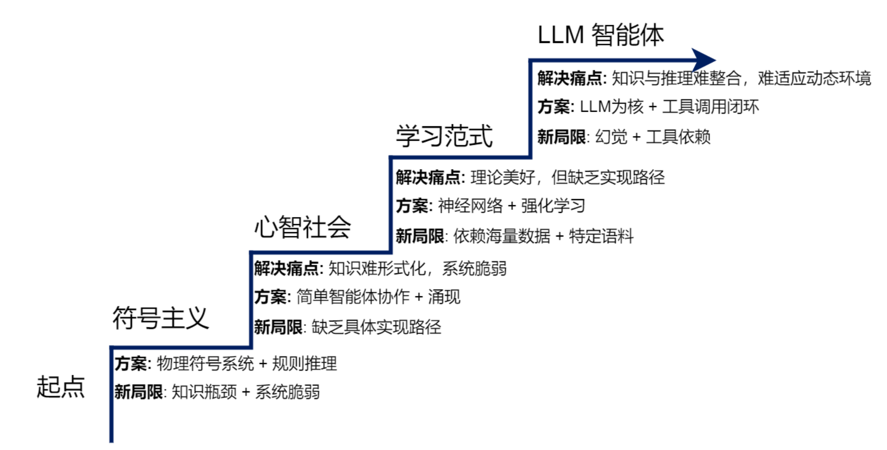

## 2.1 基于符号与逻辑的早期智能体

**物理符号系统假说（PhysicalSymbol SystemHypothesis, PSSH）**：**智能的本质，就是符号的计算与处理。**

符号主义AI典型特征：知识与推理相分离。

### 专家系统

将专家的知识和经验编写成计算机程序，使其在面对相似问题时给出媲美人类专家建议。

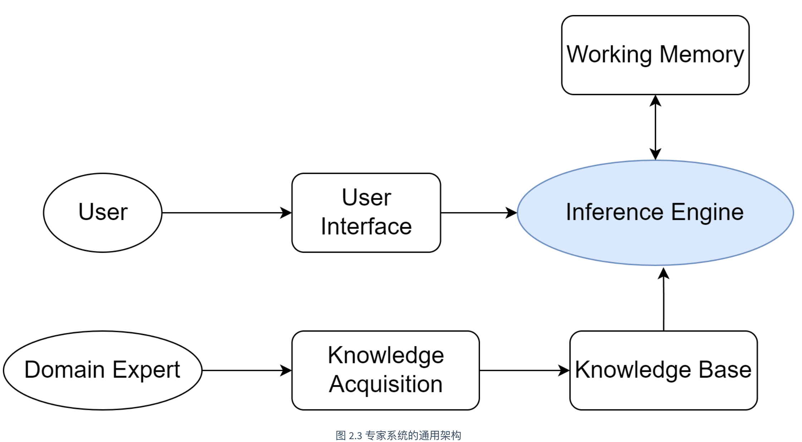

Knowledge Base，知识库：存放专家知识和经验。

    产生式规则：（IF-THEN）语句作为常用知识表示。

Inference Engine，推理机：根据用户提供的事实，在知识库里寻找并应用相关规则，推导出新结论。

    正向链（数据驱动）：从事实出发不断匹配IF部分，触发THEN结论，并将新结论加入知识库。

    反向链（目标驱动）：从假设结论出发，匹配其IF规则，然后IF规则作为新的子目标不断递归，直到所有子目标由事实可以证明。

### 符号主义面临的问题

知识库构建方面：

    知识获取瓶颈：知识库构建依赖专家信息和显示知识表示，但是将广阔世界的知识符号化成本过高。且有些知识难以用符号逻辑清晰表达。

    常识问题：人类理解世界依赖庞大常识背景，这些常识广阔模糊、难以构造匹配知识库。

动态环境处理方面：

    框架问题：智能体执行一个动作后无法高效判断什么状态没有被影响，然而为每个动作显式声明不变的状态计算上过于复杂。

    系统脆弱性：符号系统AI依赖已有规则，遇到规则之外情况可能彻底失灵。而现实世界充满“例外"。

## 2.2 构建基于规则的聊天机器人

符号主义的ELIZA并不智能：不理解语义，没有上下文状态(stateless)、规则扩展复杂，体现规则驱动系统的根本局限性。

## 2.3 马文·明斯基的心智社会

> "What magical trick makes us intelligent? The trick is that there is no trick. The power of intelligence stems from our vast diversity, not from any single, perfect principle."——《**The Society of Mind**》

机构（agency）：一组协同工作的智能体，旨在完成更复杂任务。下层智能体或机构通过去中心化的抑制或激活信号相互影响，形成动态控制流。

涌现（emergence）：大量底层或简单智能体局部交互中自发产生的复杂、有目的性的智能行为。并非由某个中央或高级智能体预先规划。

### 对多智能体系统的理论启发：构造单一全能智能体 -> 构建高效协作智能体群体

    去中心化控制：没有全知全能的中央控制器。设计没有中心节点的协调机制和任务分配策略。

    涌现式计算：复杂问题的解决方案可以从简单的局部交互规则中自发产生。

    智能体的社会性：智能体之间存在相互激活、抑制。系统研究智能体之间的通信语言、协商策略、组织结构等。

## 2.4 学习范式的演进与现代智能体

> 如果智能无法被完全设计，那么它是否可以被学习出来？

### 联结主义（connectism）

> 符号主义试图将人类的知识显式地编码给机器，而联结主义则试图创造出能够像人类一样学习知识的机器。

联结主义的深度学习为智能体赋予了强大感知能力，可以从多模态数据直接学习知识。

    知识的分布式表示：整个网络的连接模式本身构成了知识，知识以权重的形式分布存储在大量神经元之间。

    简单的处理单元：每个神经元只进行非常简单的运算。

    通过学习调整权重：系统通过接触大量样本，自行通过学习算法调节权重。系统智能并非来自预设程序，而在于“学习"过程。

### 基于强化学习的智能体

强化学习：通过与环境互动，根据反馈信号优化自身行为的机制。

强化学习智能体解决了序贯决策问题。

#### 学习目标

最大化从当前时刻到未来的回报（return）/累积奖励（cumulative reward）。有时意味着牺牲即时利润。

#### 迭代方式

强化学习智能体在一个“感知-行动-学习”的闭环中持续迭代：

1. 感知当前状态$state_t$
2. 根据当前状态$state_t$和内部策略选择动作$action_t$；
3. environment被动作$action_t$改变，返回新的状态$state_{t+1}$，即时奖励$reward_{t+1}$。智能体利用反馈更新内部策略。

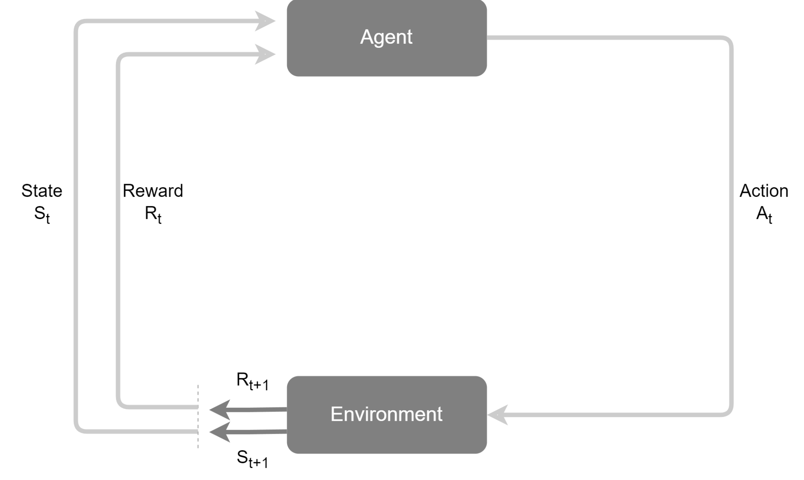

### 基于大规模数据的预训练

预训练使得智能体在开始学习具体任务之前，先具有对世界的广泛理解（赋予一定程度的先验知识）。

LLM成为兼具海量知识库与通用推理引擎的双重角色组件。

#### 预训练-微调范式

预训练：在海量数据上使用自监督学习训练一个超大规模的神经网络模型。-> 不为完成特定任务，学习语言内在规律、事实知识等。

微调：针对下游特定任务，在少量标注数据上进行训练。 -> 适应特定任务。

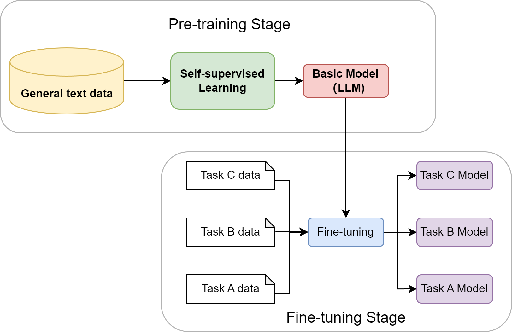

#### 大语言模型的涌现能力

规模跨越某个阈值，模型展现未被训练/意料之外的能力：

    上下文学习（In-context Learning）：无需修改模型权重，提供少量事例/0个事例（few-shot/zero-shot），模型就能理解并完成新任务。

    思维链推理（Chain-of-Thoughts）：引导模型在回答复杂问题前先输出一步步的推理过程，有助于提升输出准确性。

#### 基于大语言模型的AI智能体

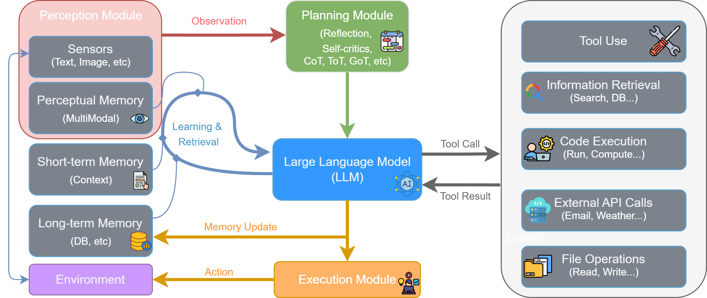

#### 感知-思考-行动循环

感知（Perception）：感知模块的传感器读取环境信息和多模态感知记忆（视觉/听觉/文本感知缓存与索引），形成observation。

思考（Thought）：

    1. 规划模块读取observation信息，拆解任务，分解成更具体可执行的步骤。

    2. LLM结合规划模块的指令，以及读取的多模态感知记忆、短期记忆、长期记忆信息，自主决策出要执行的动作。

行动（Action）：

    1. LLM的发出行动指令给执行模块，执行模块调用工具，与环境交互。环境状态被更新，工具系统返回工具结果Tool Result给LLM。

2. LLM根据行动结果更新记忆。

新的环境状态被感知模块捕捉，形成新的observation，与开启新一轮循环。

## 第二章习题

1. 物理符号系统假说 `<sup>`[1]`</sup>`是符号主义时代的理论基石。请分析：

   - 该假说的"充分性论断"和"必要性论断"分别是什么含义？
   - 结合本章内容，说明符号主义智能体在实践中遇到的哪些问题对该假说的"充分性"提出了挑战？
   - 大语言模型驱动的智能体是否符合物理符号系统假说？

     ```plaintext
     (1)
     充分性论断：符号系统具备一切产生通用智能的手段。
     必要性论断：具备展示通用智能行为的系统一定是符号系统。

     (2)
     知识获取瓶颈：知识转变为符号，效率低，成本高；有些知识难以用符号表达。
     常识问题：世界知识多样，广阔常识难以全部包含。
     框架问题：智能体无法高效知道什么状态不被改变，为动作逐个声明计算上不可行。
     系统脆弱性：依赖定义好的规则，遇到规则之外事件无能处理。

     (3)不符合。从必要性来说，LLM驱动的智能体不是符号主义智能体，但展示了通用智能行为。必要性不成立。
     ```

     ```
     (1)(2)同上
     （3）严格按经典符号主义口径，LLM 驱动智能体不属于典型物理符号系统，因此它对 PSSH 的必要性论断构成挑战；但现代 LLM Agent 往往又包含工具调用、规划和结构化中间表示，呈现出一定神经-符号混合特征。
     ```
2. 专家系统MYCIN `<sup>`[2]`</sup>`在医疗诊断领域取得了显著成功，但最终并未大规模应用于临床实践。请思考：

   > `<strong>`提示 `</strong>`：可以从技术、伦理、法律、用户接受度等多个角度分析
   >

   - 除了本章提到的"知识获取瓶颈"和"脆弱性"，还有哪些因素可能阻碍了专家系统在医疗等高风险领域的应用？
   - 如果让现在的你设计一个医疗诊断智能体，你会如何设计系统来克服MYCIN的局限？
   - 在哪些垂直领域中，基于规则的专家系统至今仍然是比深度学习更好的选择？请举例说明。

   ```plaintext
   (1)
   技术角度，专家系统不能像医生一样自主感知环境，而是依赖用户提供决策信息，可能有不完全、出错的可能性；没有记忆功能，不能根据患者过往情况专家系统难以个性化提出解决方案（如药物过敏、特殊需求等），因为考虑所有情况用符号编写过于复杂，不具有实际可行性；知识系统更新困难，不能自主学习，如果有新药物出现，需要专业人士添加相关规则，维护困难。
   伦理角度，专家系统是否有权在高风险领域代替人类决策并影响他人身体健康、经济情况等有争议。
   法律角度，而言专家系统本身无法承担责任。
   用户角度，对高风险领域采用非人工方式可能不信任。
   (2)
   使用基于LLM的智能体系统。选择表现较好的基础模型，提供在多样环境下的初步诊断能力；引入多模态能力，可以阅读患者的原始检查结果；使用分层架构，对于每一个小的疾病领域，单独引入智能体并进行微调；引入记忆能力，可以记录患者的历史病例和自身情况，并且记录之前病例的处理结果，记录相关医疗最新进展，或者医生的个性化疗法，辅助决策；再在引入严格的药物过敏、相互作用的专家系统。最终由医生开具诊断，智能体系统的结果仅供参考。
   (3)
   环境简化、知识明确、可以用符号化运算进行推理，或者对于结果可解释性要求高，对于幻觉容忍低、对即时响应要求高的领域。比如钢厂根据钢材成分分析判断是否达标的质量检测系统、飞机配平计算系统、地铁票价计算系统等。
   ```

   ```
   （1）除知识获取瓶颈和脆弱性外，还包括：输入信息可能不完整或有误、难以处理个体差异、知识更新困难、责任归属不清、用户信任不足。
   （2）现代医疗智能体应采用混合架构：LLM 负责综合分析，多模态模块读病历和检查结果，记忆模块保存病史与过敏信息，检索模块接入指南和文献，规则模块严格检查药物禁忌和合规约束，最终由医生决策。
   （3）规则专家系统仍适合规则明确、可解释性要求高、容错率低的场景，如税务规则、票价计算、报销审批、工业安全联锁。
   ```
3. 在2.2节中，我们实现了一个简化版的ELIZA聊天机器人。请在此基础上进行扩展实践：

   > `<strong>`提示 `</strong>`：这是一道动手实践题，建议实际编写代码
   >

   - 为ELIZA添加3-5条新的规则，使其能够处理更多样化的对话场景（如谈论工作、学习、爱好等）
   - 实现一个简单的"上下文记忆"功能：让ELIZA能够记住用户在对话中提到的关键信息（如姓名、年龄、职业），并在后续对话中引用
   - 对比你扩展后的ELIZA与[ChatGPT](https://chatgpt.com/)，列举至少3个维度上存在的本质差异
   - 为什么基于规则的方法在处理开放域对话时会遇到"组合爆炸"问题并且难以扩展维护？能否使用数学的方法来说明？

   ```plaintext
   (1)(2)已用codex进行辅助编程完成。
   (3)
   感知能力：ELIZA不能进行多模态感知。ChatGPT可以。
   推理能力：ELIZA依赖显式编程的规则推理。ChatGPT用神经网络推理。
   知识水平：ELIZA知识库和推理模块分开。ChatGPT兼具海量知识库与通用逻辑推理。
   语义理解：ELIZA依赖机械匹配，不能理解语义。ChatGPT可以。
   (4)开放域对话中，若一次对话需要考虑m个因素，每个因素k个取值，则所有可能的状态有k^m个，产生组合爆炸。
   ```

   ```
   （1）可增加规则如：
   	•	I work as (.*) → How do you feel about working as {0}?
   	•	I am studying (.*) → What interests you most about studying {0}?
   	•	My hobby is (.*) → How long have you enjoyed {0}?
   （2）可用简单字典保存 name / age / job，从输入中抽取并在后续回复中引用。
   （3）ELIZA 与 ChatGPT 的本质差异：知识表示不同，前者靠显式规则，后者靠分布式参数；语义理解不同，前者是模式匹配，后者具备较强统计语义能力；上下文与泛化能力不同，后者远强于前者。
   （4）开放域对话中，若有 m 个语义维度、每个维度 k 种可能，则规则数可能达到 k^m，呈指数增长，因此会发生组合爆炸并难以维护。
   ```
4. 马文·明斯基在"心智社会"理论 `<sup>`[7]`</sup>`中提出了一个革命性的观点：智能源于大量简单智能体的协作，而非单一的完美系统。

   - 在图2.6"搭建积木塔"的例子中，如果 `GRASP` 智能体突然失效了，整个系统会发生什么？这种去中心化架构的优势和劣势是什么？
   - 将"心智社会"理论与现在的一些多智能体系统（如[CAMEL-Workforce](https://docs.camel-ai.org/key_modules/workforce)、[MetaGPT](https://github.com/FoundationAgents/MetaGPT)、[CrewAI](https://github.com/crewAIInc/crewAI)）进行对比，它们之间存在哪些关联和不同之处？
   - 马文·明斯基认为智能体可以是"无心"的简单过程，然而现在的大语言模型和智能体往往都拥有强大的推理能力。这是否意味着"心智社会"理论在大语言模型时代不再适用了？

     ```
     (1)
     那么上级的GET-BLOCK机构也将失效，其更上级的机构也会失效，整个系统都会失效。
     优势：无需拥有全能的中央控制器，智能由底层智能体的自发交互产生；
     劣势：若底层智能体失效，整个系统便无法完成推理；智能体或机构无法理解正在进行的事件。
     (2)
     关联：都是去中心化控制；智能体都有相互协作。
     不同：现代多智能体系统的单个智能体都较为智能；现代多智能体系统一般由planning module进行任务分配，这个module对任务拥有全局规划，而心智社会没有这个角色。
     (3)不是，他的去中心化控制、涌现式计算、以及强调智能体之间的交互现在仍然适用。
     ```

     ```
     （1）若 GRASP 失效，抓取相关的下层机构无法完成动作，进而导致 GET-BLOCK、ADD-BLOCK、BUILD-TOWER 这条任务链失败。优势是无需中央全能控制器，复杂智能可由局部交互涌现；劣势是依赖关系复杂，局部失效会向上传播，系统难调试。
     （2）它与现代多智能体系统都强调协作和去中心化，但心智社会中的智能体更简单、更“无心”；现代 MAS 中单体智能体往往更强，且常有更明确的规划、通信和角色机制。
     （3）心智社会理论在 LLM 时代仍然适用，因为复杂智能依然常通过多个模块或智能体协作产生，只是今天的单体能力更强了。
     ```
5. 强化学习与监督学习是两种不同的学习范式。请分析：

   - 用AlphaGo的例子说明强化学习的"试错学习"机制是如何工作的
   - 为什么强化学习特别适合序贯决策问题？它与监督学习在数据需求上有什么本质区别？
   - 现在我们需要训练一个会玩超级马里奥游戏的智能体。如果分别使用监督学习和强化学习，各需要什么数据？哪种方法对于这个任务来说更合适？
   - 在大语言模型的训练过程中，强化学习起到了什么关键性的作用？

   ```
   (1)AlphaGo通过观察棋盘状态，执行动作，最后得到这局是赢是输的奖励信号，赢则奖励为正，输则奖励为负。经过多次这样的对弈，AlphaGo不断调整策略，最终，对于某种棋盘状态，会选择长期期望奖励最大的动作。
   (2)
   因为强化学习读取当前环境，根据环境返回的奖励信息指导动作选择，非常适合指导当前状态下的决策。序贯决策就是不断根据变化的状态进行决策。
   监督学习依赖大量标注好的数据，而强化学习无需标注，奖励信号由与环境交互过程中生成。
   (3)
   监督学习：遇到每一种交互物品的奖励标注；路线的标注。
   强化学习：准备一个模拟环境或直接使用真实环境，让智能体自行探索即可。
   强化学习方法更合适，这属于序贯决策任务，无需人工数据标注，自动进行学习。
   (4)赋予大模型从与环境交互中学习策略的能力，减少了标注数据的需求。
   ```

   ```
   （1）AlphaGo 在每个棋盘状态下选择动作，整局结束后根据胜负获得奖励，通过大量自我对弈不断更新策略，学习长期回报最大的动作。
   （2）强化学习适合序贯决策，因为当前动作会影响未来状态和回报；监督学习学习的是输入到标签的静态映射。监督学习依赖人工标注数据，强化学习依赖与环境交互得到的状态、动作、奖励。
   （3）训练马里奥时，监督学习需要人类玩家示范数据，如画面帧对应按键；强化学习只需游戏环境和奖励设计。该任务更适合强化学习。
   （4）在 LLM 训练中，强化学习主要用于对齐阶段，如 RLHF，通过奖励模型让输出更符合人类偏好、更安全、更符合指令。
   ```
6. 预训练-微调范式是现代人工智能领域的重要突破。请深入思考：

   - 为什么说预训练解决了符号主义时代的"知识获取瓶颈"问题？它们在知识表示方式上有什么本质区别？
   - 预训练模型的知识绝大部分来自互联网数据，这可能带来哪些问题？如何缓解以上问题？
   - 你认为"预训练-微调"范式是否可能会被某种新范式取代？或者它会长期存在？

   ```
   (1)预训练将海量知识存储在神经元的权重里。这些知识数量大，全部用符号表示经济上不可能，且现实世界有许多知识无法用符号表示。预训练的深度神经网络用网络连接情况表示知识，符号主义使用符号定义的规则。
   (2)数据不准确；冗余数据多；有有毒数据。数据清洗与筛选，加大可信来源数据权重；建立隐私合规与过滤机制；后训练阶段加入对齐与纠错机制，建立黑名单制度，人工规定生成禁止项，并保存在system prompt中。
   (3)目前我认为会长期存在。因为这很好解决了知识获取瓶颈问题和对于给定任务的针对性问题。
   ```

   ```
   （1）预训练通过海量数据和自监督学习，让模型自动获取知识，避免了符号主义手工编码知识的高成本；符号主义是显式规则表示，预训练模型是分布式参数表示。
   （2）互联网数据可能带来错误信息、偏见、低质量内容、有毒数据、隐私与版权问题、知识过时和数据投毒。缓解方法包括数据清洗筛选、可信源加权、隐私与合规过滤、后训练对齐，以及检索增强和工具调用。
   （3）预训练-微调短期内不会消失，但会被扩展为更大的复合范式，如“预训练 + 检索 + 工具 + 在线学习”，更可能被增强而不是被完全替代。
   ```
7. 假设你要设计一个"智能代码审查助手"，它能够自动审查代码提交（Pull Request），概括代码的实现逻辑、检查代码质量、发现潜在BUG、提出改进建议。

   - 如果在符号主义时代（1980年代）设计这个系统，你会如何实现？会遇到什么困难？
   - 如果在没有大语言模型的深度学习时代（2015年左右），你会如何实现？
   - 在当前的大语言模型和智能体的时代，你会如何设计这个智能体的架构？它应该包含哪些模块（参考图2.10）？
   - 对比这三个时代的方案，说明智能体技术的演进如何使这个任务从"几乎不可能"变为"可行"

```
(1)使用逻辑语言覆盖所有编码规则，将代码逐行与规则进行匹配。困难：编码规则复杂，翻译为符号语言费时费力；无法概括代码实现逻辑；无法理解程序，有些BUG在语法上合规但是实际可能有问题（如特定条件下跳出的死循环）；对于明显语法错误可能可以提供改进建议，但是大部分情况难以提供。
(2)学习大量代码，辅助专家系统做语法检查。需要大量标注数据进行学习，也需要大量的正例反例；但是仍然无法概括代码的实现逻辑、提出改进建议；知识难以泛化，不同语言的代码的材料可能无法互通。
(3)感知模块、规划模块、LLM、执行模块、记忆模块。LLM作为中枢，调用各种skill(每一个skill也可对应一个LLM智能体)进行不同功能。
(4)符号主义智能面临严重的知识瓶颈和系统脆弱性问题；深度学习解决了知识瓶颈问题，并赋予智能体不断学习的能力；LLM依赖的预训练+微调范式使得智能体具有广泛的通用知识和对于特定任务的适应能力，能理解并生成自然语言、自主地规划执行任务。使得情况多样、需要理解代码、需要自然语言交互的智能代码审查任务成为可能。
```

```
（1）符号主义时代可用规则库、语法分析和 AST 匹配实现编码规范检查与部分静态分析，但难以理解程序语义、跨文件逻辑和隐蔽 Bug，也难以生成高质量自然语言建议。
（2）无大语言模型的深度学习时代，可结合静态分析工具与代码表示学习模型，做缺陷预测、命名建议、简单注释生成等，但长上下文理解和自然语言审查能力仍弱。
（3）当前可设计为：感知模块读取 PR diff、相关文件和测试结果；记忆模块保存仓库规范、历史审查意见和架构知识；规划模块拆解任务；LLM 负责代码理解和意见生成；执行模块调用静态分析、测试、搜索等工具；最后输出结构化审查报告。
（4）三个时代的演进体现为：符号主义擅长明确规则但缺乏语义理解，早期深度学习能学模式但泛化和长上下文有限，LLM + Agent 时代才同时具备代码理解、自然语言生成、工具调用和任务规划能力，使自动代码审查真正可行。
```

# 第三章 大语言模型基础

## 3.1 语言模型与Transformer架构

> 语言模型的根本任务：预测一个词序列（一个句子）出现的概率。

### 从N-gram到RNN

#### 统计语言模型和N-gram

语言模型的统计方法：一个句子出现的概率=这个句子每个词出现的条件概率的连乘。

##### 概率的链式法则

局限：不是所有词序列都一定在语料库里出现。

##### 马尔可夫假设

一个词出现的概率只与前面的$n-1$个词有关。

##### N-gram模型

- Bigram(N=2)：假设一个词的出现只与前面的1个词有关。

  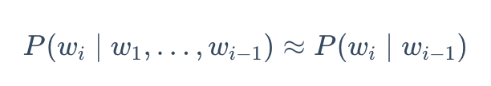
- Trigram(N=3)：假设一个词的出现只与前面的2个词有关。
- ……

条件概率的极大似然估计

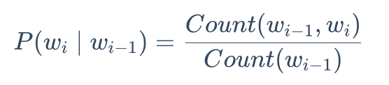

$Count(w_{i-1}, w_i)$：词序列 $w_{i-1}, w_i$ 出现的计数。

$Count(w_{i-1})$：词 $w_i$ 出现的计数。

N-gram模型的局限：

    数据稀疏性：若一个词序列从未在语料库中出现则概率为0。

    泛化能力差：无法理解词与词之间的语义相似性。例如：“土豆是马铃薯"在语料库中可能出现很多次，但是如果”洋芋是马铃薯"这个词序列或者“洋芋”这个词根本没有出现过，则“洋芋是马铃薯"这个词序列的概率仍为0。

#### 神经网络语言模型与词嵌入

**前馈神经网络语言模型 (Feedforward Neural Network Language Model)**

    构建语义空间：构建高维连续空间，词汇表中的每个词映射为空间中的一点（词向量/词嵌入(word embedding))。语义相近的词在空间中的位置靠近。词嵌入可以在模型训练过程中自动得到，也可以使用预训练权重。

    学习映射函数：使用神经网络学习前$n-1$个词到词汇表每个词在当前上下文出现后的概率分布。

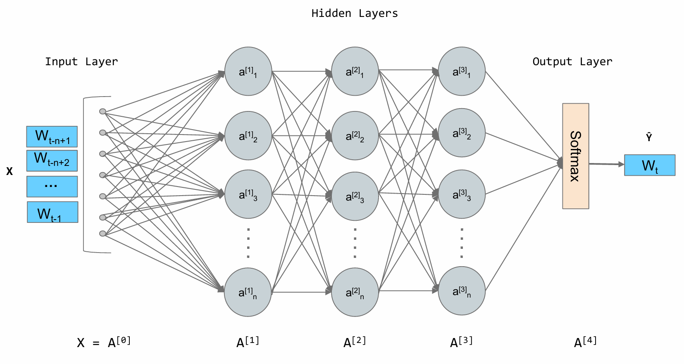

词向量的相似程度的度量：余弦相似度[-1,1]

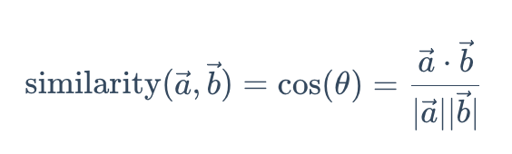

词嵌入不仅可以捕捉“相似"关系，还能捕捉”类比"关系。如 `similarity('king'-'man'+'woman','queen')`约等于1。

局限：上下文窗口仍然固定，只能考虑固定数量的前文。

#### 循环神经网络(RNN)与长短时记忆网络(LSTM)

##### 循环神经网络RNN

```
打破固定窗口限制，为模型增加“记忆"能力。
```

RNNcell在处理序列的每一步，读取当前输入词和上一步的隐状态(hidden state)/记忆，输出这一步对应的隐状态。

如此循环使得记忆可以由序列最开头往后传递，序列长度=网络深度。

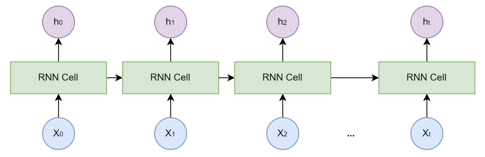

局限：长期依赖问题，网络深度取决于序列长度，梯度从后向前传播会经过多次连乘，导致梯度爆炸/消失。

##### 长短时记忆网络LSTM

> 细胞状态和门控机制更能保留长期信息。

    细胞状态$C$(Cell State)：独立于隐藏状态$h$的信息通路。

    门控机制(Gating Mechanism)：几个小型的神经网络。有选择地让信息通过，从而控制细胞状态和隐状态的信息增加和删除。

    - 遗忘门：决定从上一时刻的细胞状态丢弃哪些信息

    - 输入门：决定当前输入中哪些新信息存入细胞状态

    - 输出门：决定根据当前细胞状态输出什么信息到隐藏状态。

（图中X为逐位乘，+为逐位加，σ（sigmoid），tanh均为激活函数，需要学习的神经网络为激活函数前的线性层）

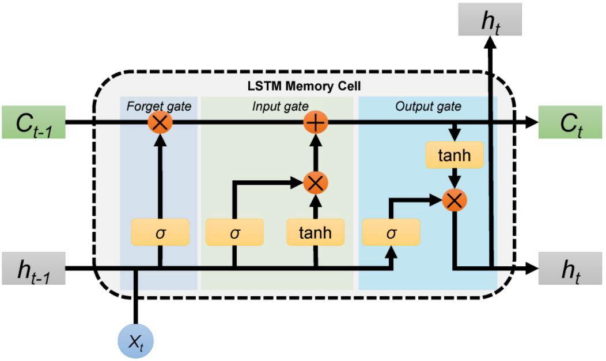

局限：

1. 长程记忆仍通过细胞状态逐级传递，很长距离的信息会逐步衰减或被覆盖，远距离token之间的交互路径仍太长
2. 需要按线性顺序处理数据，不支持并行。

### Transformer架构解析

> 完全抛弃循环结构，使用注意力(Attention)机制捕捉序列内的依赖关系，实现对长序列的并行计算。

Transformer 是一个由 Encoder–Decoder 组成的序列建模架构：Encoder 用多头自注意力和前馈网络提取输入序列的上下文表示，Decoder 用掩码自注意力、跨编码器注意力和前馈网络逐步生成输出序列，最终通过 Linear + Softmax 预测下一个 token。

#### Encoder/Decoder架构

    Encoder编码器：用于“理解"输入的词序列。读取所有的输入词元，为每个词元生成一个富含上下文信息的向量表示。

    Decoder解码器：用于“生成"目标词序列。参考自己已经生成的前文和编码器结果，生成下一个词。输出的是词表中每个词的概率。（训练时输入的是目标句右移版本，并行训练时实际上会输入整个目标句，对于一个token需要把其后面位置的信息遮盖掉，即masked attention）

同样的编解码器串行重复N次形成encoder/decoder stack。

#### Embedding词嵌入

将输入/输出token转换为向量表示。维度数量用$d_{model}$表示。

输出在训练时表示将目标序列右移一位，使encoder读取已经生成的序列，以便学习预测下一个词。

#### Positional Encoding位置编码

为每一个token添加绝对位置和相对位置信息，捕捉token的排列信息（如区分不同位置的相同词）。

    其中：

- $d_{model}$中奇数维的维度加上正弦函数，偶数维的维度加上余弦函数。sin/cos编码通过为每个pos生成一个多频率的周期向量来表示绝对位置，两个pos之间的位置差可以看作一对PE向量的旋转角度。
- $pos$是一个token在词序列（单句中）中的位置。

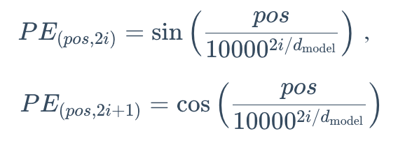

#### Attention注意力机制

##### Self-attention自注意力

在模型处理序列中的一个词时，为序列中的其他词分配不同的注意力权重，权重越高代表与当前词关系越强，其信息在当前词的表示占更大权重。

自注意力机制为每一个token向量引入可学习元素：

- Query, Q, 查询（这个token关注什么）：代表当前token的一个向量，用这个向量与其他token（含自身）的K向量做内积运算反映出其他词对本词的重要性。
- Key, K, 键（这个token有什么特征）：代表token的“标签"或”索引"。
- Value, V, 值（这个token有什么内容可以提供）：代表token本身携带的信息。

这三个向量由原始词嵌入，乘三个可以学习的权重矩阵($W^Q$, $W^t$, $W^v$)得出。

自注意力的计算过程(词序列长度T, 注意力头维度(Q, K, V维度)$d_k$)：

1. 处理一个句子时，先对于每个词都生成对应的QKV。
2. 对于每一个token，用自身的Q与句子中的所有词的K做内积运算。这个得分反应出其他词对本词的重要性。($T \times T$维度，句子中任意两词之间的注意力分数)。
3. 除以$\sqrt{d_k}$，防止注意力分数过大导致梯度过小。（若假设，单独的一维q、k是相互独立的变量，且满足均值为0方差为1的分布，那么总和标准差是$\sqrt{d_k}$级别）
4. softmax对于每一个词的q对应的行进行归一化，使的每一个词对应的注意力分数满足一个和为1的概率分布。
5. 乘V，每一个token都得到一个融合了上下文的新表示。（$T \times d_k$维度，每一个词对应一个维度为$d_k$的表示）


##### Multi-Head Attention多头注意力

使用多个注意力头，将QKV向量分为$h$份（$h \times d_k = d_{model}$ )，每个注意力头独自进行运算，再拼接，最后使用线性变化合并。不同注意力头可实现对不同种类的特征的提取。好比像多个专家从不同角度审视一个句子，再使用线性变化将多个专家的表达融合。

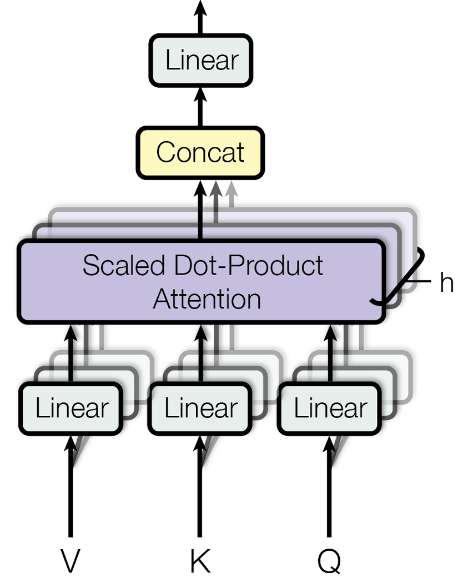

#### FFN前馈神经网络，Feed-Forward Network

> 从注意力层聚合的信息中提取更高阶特征。

Transformer中是逐位置前馈神经网络，对于每一个位置的token，单独进行一次运算，但所有位置的token都共享同一组权重。原因为保留对每个位置进行独立加工的权利，同时减少参数量。

FFN一般为 `线性层-ReLU-线性层`结构，$W_1, b_1, W_2, b_2$为可学习参数。第一个线性层的输出维数>>$d_{model}$，第二层映射回$d_{model}$维数。特征空间先扩大再缩小，被认为利于丰富特征表示。


#### Add残差连接

子模块输入直接加到子模块的输出，反向传播时梯度可以绕过子模块传播，解决梯度消失问题。

#### Norm层归一化

把单个样本的所有特征（一个token对应的$d_{model}$维表示向量）归一化，使其均值为0方差为1。解决内部协变量偏移问题（训练中参数更新后，下一层的输入取决的上一层的输出分布可能发生变化），加速模型收敛。

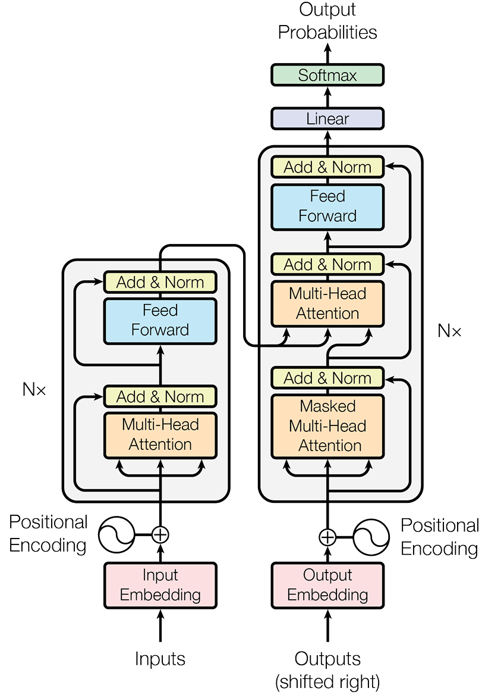

### Decoder-Only 架构

> 训练时并行，推理时自回归串行。

GPT(Generative Pre-trained Transformer)：抛弃transformer的编码器部分，只保留解码器部分。

#### Autoregressive自回归

给定初始语句，预测下一个词，再把刚生成词添加到上一步的输入语句作为新的输入语句，如此循环，直到达成停止条件。

#### Masked Self-Attention掩码自注意力

Decoder进行训练时，对于一个batch进行并行训练。例如训练文本是$abc$，右移一位将变成 $<bos>abc$，训练时一次性输入训练文本，将并行训练 $<bos>->a, <bos>a->b, <bos>ab->c$三项任务。

为了使前面的任务不“偷看"后面，在自注意机制计算出attention矩阵后（$T \times T$维，每一个位置的token对所有位置的token的注意力分数），把当前位置token之后的token对应的分数变为一个非常大的负数（负无穷），softmax之后，这些位置的概率变为0。达到训练时，当前位置token生成只参考当前位置及之前位置token的效果。

#### Decoder-only架构的优势

1. 训练目标简单：唯一任务是“预测下一个词"，非常适合在海量无标注文本进行自监督与训练。
2. 结构简单，易于扩展。
3. 架构天然适合生成任务：自回归的工作方式，契合生成式任务。

## 3.2 与大语言模型交互

### 提示工程

> 研究如何设计出精准的提示，引导大模型产生期望回复。

#### 模型采样参数

##### Softmax公式：模型采样参数的基础

把任意一组实数（logits)经过指数放大和归一化，转换为一个和为1的概率分布，从而可以表示“每个类别发生的概率"。

$$
p(z_i)=p_i=\frac{e^{z_i}}{\sum_{j=1}^{n}e^{z_j}}
$$

其中：

    输入（logits）：$z=[z_1, z_2,...,z_n]$为n维度输入向量

    输出（概率分布）：n维度向量，每个分量[0,1]之间，各分量和为1

采样参数是在原有softmax基础上，根据不同策略重新调整或截断分布，以改变模型输出的下一个token。因为大多数LLM会按概率分布采样将要输出的token。

##### Temperature温度：控制模型输出随机程度

引入温度系数$T \gt 0$，将softmax改写为：

$$
p(z_i/T)={p_i}^{(T)}=\frac{e^{z_i/T}}{\sum_{j=1}^{n}e^{z_j/T}}
$$

T对输出结果的影响：

    T变小，高概率权重放大，生成“保守"，重复性高文本；

    T变大，高概率权重变小，生成”多样"，但可能不连贯内容。

| T            | z/T       | p(z/T)             |
| ------------ | --------- | ------------------ |
| 0.5(陡峭)    | [4,2,0]   | [0.86, 0.12, 0.02] |
| 1(原softmax) | [2,1,0]   | [0.66, 0.24, 0.09] |
| 2(平滑)      | [1,0.5,0] | [0.50, 0.30, 0.20] |

T的经验值：

| T          | 类别   | 适用领域                                     |
| ---------- | ------ | -------------------------------------------- |
| (0, 0.3)   | 低温度 | 事实性任务：数据计算、代码生成、法律条文解读 |
| [0.3, 0.7) | 中温度 | 日常对话                                     |
| [0.7, 2)   | 高温度 | 创意性任务：诗歌创作、科幻故事构思           |

##### Top-k

将所有token的概率从高到低排序，选取前k名（前k名组成候选集）进行归一化。

$$
\hat{p}_i = \frac{p_i}{\sum_{j \in \text{候选集}} p_j}
$$

k=1时输出完全确定，退化为“贪心采样"。

##### Top-p

将所有token的概率从高到低排序，从排序后的第一个token开始，逐步累加概率直到≥p，此时所有被累加的token组成“核集合"，对核集合进行归一化。

相较于Top-k的优势：对长尾分布的适应性更好，更适用于概率分布不均匀的极端情况。

##### 多个模型采样参数同时设置

按照Temperature -> Top-k ->Top-p的顺序分层协同。

通常Top-p和Top-k二选一即可。若同时设置，候选集为交集。

#### 零样本、单样本与少样本提示

- Zero-shot Prompting零样本提示：不给模型任何示例，直接让其根据指令完成任务。需要模型强大泛化能力。
- One-shot Prompting单样本提示：给模型提供一个完整的示例，向其展示任务格式和期望的输出风格。
- Few-shot Prompting少样本提示：提供多个示例，让模型更全面理解任务，准确理解任务的细节、边界。

#### Instruction Tuning指令调优

早期GPT模型主要是“文本补全"模型，擅长续写工作。

指令调优微调技术，使用大量“指令-回答"格式数据对于预训练模型进行训练，使得模型能更好遵循并理解用户指令。

#### Role-playing角色扮演

赋予模型特定角色，引导回答风格、语气、知识范围，使其输出符合特定场景需求。

#### In-context Example上下文示例

与少样本提示的思想一致，在提示中提供清晰的输入输出示例，让模型理解用户请求，在处理复杂格式或特定风格非常有效。

#### Chain-of-Thought思维链(CoT)

引导模型显式展示推理过程，提升模型在复杂任务的推理能力。模型不仅更可能得出正确答案，还能使回答更易于被检查和修正，提高回答可信度。

### 文本分词

Tokenization分词：将文字序列转换为计算机可以处理的数字序列。

Tokenizer分词器：使用一套规则，将原始文本切分成一个最小单元。

Token词元：文本被切分出的最小单元。

#### 简单分词策略

##### Word-based按词分词

直接用标点符号或空格将句子切分单词。
不足：

- 词表爆炸：语一个语言词汇量巨大，每个词都作为一个独立的词元，词表难以管理。
- Out-of-Vocabulary未登录词，OOV：未在词表里出现的词，模型无法处理。
- 语义关联缺失：词形相近之间的语义关系不能被捕捉，即使他们具有相同内在含义。训练中低频词的语义难以被模型充分学习。

##### Character-based按字符分词

将文本切分为单个字符。

词表很小（英文字母、数字、标点……），方便管理。

不足：

- 单个字符一般不具有语义信息，模型需要耗费更多精力学习字符如何组合，学习效率低下。

##### Subword Tokenization子词分词

将常见词保留为完整词元，将不常见词拆分为“有意义"片段(token,ization)。既控制词表大小，又能使模型可以通过组合子词来理解新词。

#### Byte-pair Encoding字节对编码BPE

> 最主流的子词分词算法，GPT系列使用这种分词算法。

过程（贪心算法）：

1. 初始化：使用character-based按字符分词策略从语料库构建初始词表。
2. 迭代合并：找到语料库中相邻词元对中频率最高的一个，合并为一个新词元，加入词表。
3. 重复：重复迭代合并，直到词表长度达到阈值。

例子：语料库{"hug": 1, "pug": 1, "pun": 1, "bun": 1}，词表目标大小为10。

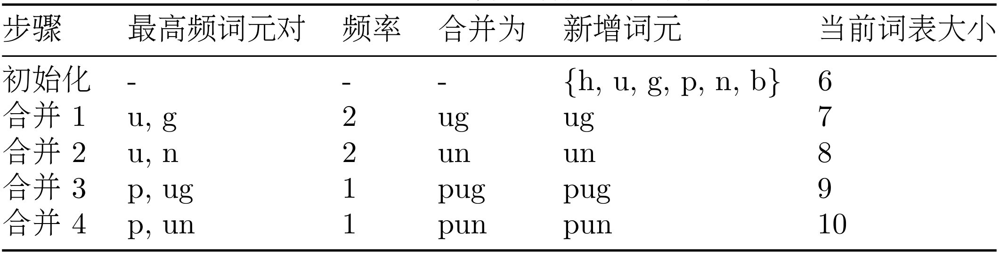

训练结束后按照前缀匹配切分新词。(bug->bu,g->b,ug，都在词表中，切分完成)

可以显式在语料库中增加词汇开头和结尾标识符，以便让模型可以区分“完整词结尾”和“词内部片段”，这在大语料、有限 merge 次数和边界敏感的分词中更重要。（`out<\w>`和 `outnumber<\w>`、`outperform<\w>`中的out不是一个含义，理应有 `out<\w>`（完整词，出去）和 `out`（前缀，超过）两种词元。

对BPE的优化：

- Wordpiece：BERT采用。优先合并那些能让整个语料库的“通顺度”提升最大的词元对。
- Sentencepiece：将空格视作一个普通字符(_)。使分词和解码完全可逆；把原始文本字符视作统一字符序列，不依赖空格分词，不依赖特定语言（如中文没有空格，可以混合语言输入）。

分词器的影响：

1. 上下文窗口限制：LLM的上下文窗口由token计算。不同分词器token数量差可能差别巨大。
2. API成本：大多数API按token计费。了解分词方式有助于预估API成本。
3. 分词错误可能导致表现异常。如分词器将 `2(空格)+(空格)2`和 `2+2`分成不同token，但只训练了 `2+2`，导致不理解 `2(空格)+(空格)2`。

### 调用开源大语言模型

使用Qwen.py调用Hugging Face镜像站的Qwen/Qwen1.5-0.5B-Chat模型。

### 模型的选择

LLM的选择需针对任务特性，在性能、成本、速度、部署方式之间权衡决策。

## 3.3 大语言模型的缩放法则与局限性

### Scaling Laws缩放法则

LLM的性能（通常用Loss衡量）随**参数量**、**训练数据集大小**、**训练计算量**成平滑幂律关系。三者需要**同步按比例**增长。

在给定的计算预算下，模型参数量与训练数据集大小存在最优配比。

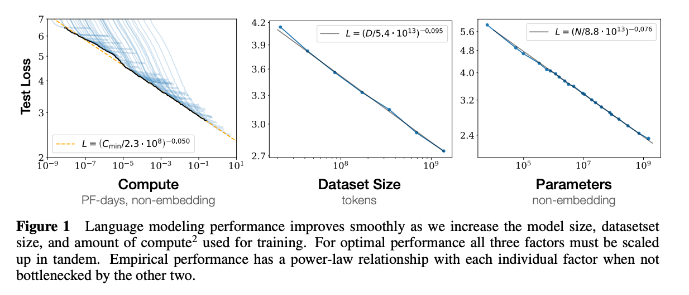

> Kaplan J, McCandlish S, Henighan T, et al. Scaling laws for neural language models[J]. arXiv preprint arXiv:2001.08361, 2020.

#### 能力涌现

缩放法则的产物。随着模型规模达到一定阈值，会涌现小模型上不存在的能力。如：链式思考、指令遵循、代码生成等能力。

一个足够大规模的模型是实现具有自主复杂决策和规划的智能体的前提。

### Hallucination模型幻觉

大模型生成的内容与客观事实、用户输入或者上下文相矛盾。或生成了不存在的事实、实体或事件。

分类：

- Factual Hallucinations事实性幻觉：模型生成与现实世界不符的信息。（询问一个学者的文献发表情况时编造不存在的论文）
- Faithfulness Hallucinations忠实性幻觉：在文本翻译、摘要等任务中，模型生成信息没有忠实反映原文本含义。（unacceptable翻译成“可接受的"）
- Intrinsic Hallucinations内在幻觉：模型输出与输入信息直接矛盾。（要指出某论文缺点，却给出优点）

幻觉的成因和对应的缓解方法：

| 层面           | 幻觉成因                                                                    | 缓解方法                                                                                                                                                                                                                                                   |
| -------------- | --------------------------------------------------------------------------- | ---------------------------------------------------------------------------------------------------------------------------------------------------------------------------------------------------------------------------------------------------------- |
| 数据层面       | 训练数据中包含矛盾或错误信息、时效性不足或存在偏见                          | 数据清洗、引入事实性知识、RLHF(强化学习与人类反馈，从源头减少幻觉)                                                                                                                                                                                         |
| 模型架构层面   | LLM的自回归生成机制决定其只是在预测下一个最可能词元，并没有内置事实核查模块 | 探索新的模型架构；让模型能够表达对其生成内容的不确定性                                                                                                                                                                                                     |
| 推理与生成层面 | 处理复杂推理任务时，可能在逻辑链条出错                                      | 1. RAG检索增强生成：最有效的幻觉缓解方式。在生成之前从外部知识库检索相关信息，然后将检索信息作为上下文，引导模型基于事实回答。<br />2. 引导模型进行多步推理与验证<br />3. 引入外部工具：引入搜索引擎、计算器、代码生成器等外部工具获取实时信息或精密计算。 |

## 第三章习题

1. 自然语言处理中，语言模型经历了从统计到神经网络的模型演进。

   - 请使用本章提供的迷你语料库（`datawhale agent learns`, `datawhale agent works`），计算句子 `agent works` 在Bigram模型下的概率
   - N-gram模型的核心假设是马尔可夫假设。请解释这个假设的含义，以及N-gram模型存在哪些根本性局限？
   - 神经网络语言模型（RNN/LSTM）和Transformer分别是如何克服N-gram模型局限的？它们各自的优势是什么？

   ```markdown
   (1) p(agent works) = p(agent) * p(works|agent) = [count(agent)/count(*)] * [count(agent works)/count(agent)] = (2/6) * (1/2) = 1/6
   (2) 
   马尔可夫假设认为一个词出现的概率仅于前面出现的n-1个词有关。
   N-gram存在的局限：
   - 数据稀疏性：没有在训练中出现过的词，概率永远为0.
   - 泛化能力差：将词看作离散的符号，不能捕捉词之间的语义相近关系。
   - 上下文窗口固定：所能看到的上下文窗口是固定的N值，处理任意长序列时，窗口外的信息会被丢弃。

   (3) 
   - RNN：在词嵌入向量将词映射为高维空间的点向量，解决数据稀疏性和泛化能力问题基础上，引入hidden state为模型增添了“记忆"，串行的RNN Cell读取当前输入词和上一个cell的hidden state，生成新的hidden state传递给下一个RNN Cell，如此循环往复使得信息可以不断从前往后传递。优势是可以处理任意长的序列。
   - LSTM：在RNN基础上引入细胞状态和门控机制，细胞状态开辟了一条与hidden state独立的信息通路，门控机制精细控制每一步要遗忘或保留的信息。优势是一定程度上解决了RNN的梯度消失或梯度爆炸问题。
   - Transformer使用注意力机制捕捉序列的依赖关系，允许词序列中的每个词都能关注词序列的其他词。优势是可以并行处理一个词序列中的所有词，不同个词序列也能并行训练，一个batch更新一次参数。
   ```

   ```markdown
   （1）在语料库 datawhale agent learns, datawhale agent works 中，
   P(agent\ works)=P(agent)\cdot P(works|agent)
   其中
   P(agent)=\frac{2}{6},\quad P(works|agent)=\frac{Count(agent,works)}{Count(agent)}=\frac{1}{2}
   所以
   P(agent\ works)=\frac{2}{6}\cdot \frac{1}{2}=\frac{1}{6}

   （2）马尔可夫假设指：当前词出现的概率只依赖于前面有限个词，而不是依赖全部历史。在 N-gram 中，就是近似认为
   P(w_i|w_1,\dots,w_{i-1})\approx P(w_i|w_{i-n+1},\dots,w_{i-1})
   N-gram 的根本局限包括：数据稀疏性严重、未见过的组合概率为 0；把词当作离散符号，无法利用语义相似性，泛化能力差；上下文窗口固定，无法建模长距离依赖。

   （3）神经网络语言模型通过词嵌入把词映射到连续向量空间，缓解了离散符号表示带来的泛化问题。RNN 用 hidden state 把历史信息沿序列传递，从而突破固定窗口限制；LSTM 在 RNN 基础上加入 cell state 和门控机制，缓解梯度消失，更擅长建模较长依赖。Transformer 则完全放弃循环结构，依赖自注意力机制让每个位置直接关注序列中其他位置，既能更好建模长距离依赖，又能并行计算。RNN/LSTM 的优势是序列建模思路自然；Transformer 的优势是长依赖建模更强、训练更高效、易扩展到大模型。
   ```
2. Transformer架构 `<sup>`[4]`</sup>`是现代大语言模型的基础。其中：

   > `<strong>`提示 `</strong>`：可以结合本章3.1.2节的代码实现来辅助理解
   >

   - 自注意力机制（Self-Attention）的核心思想是什么？
   - 为什么Transformer能够并行处理序列，而RNN必须串行处理？位置编码（Positional Encoding）在其中起什么作用？
   - Decoder-Only架构与完整的Encoder-Decoder架构有什么区别？为什么现在主流的大语言模型都采用Decoder-Only架构？

   ```
   (1) 注意力权重越高的词，与当前词的关联越强，权重高的词在当前词的表示中将占据更大比重。
   (2) 
   token向量化后，每个词并行乘上注意力权重矩阵就可以获得QKV值，注意力分数也可以通过矩阵运算并行计算，因此Transformer可以并行处理序列。RNN当前词对应的hidden state依赖上一个RNN Cell给出，因此无法并行处理。
   位置编码与词嵌入向量相加，添加了词的位置信息，使得模型可以区分一个词在词序列不同的位置时可能的不同的含义。
   (3)
   Decoder-Only架构只保留了Decoder解码器部分，删除了Encoder编码器部分。Decoder-Only架构使用自回归的工作模式，当前输出内容会拼接到已输出内容上，作为下一个的输入内容，如此循环。
   Decoder-Only架构自回归的工作模式天然适合“预测下一个词"型任务；结构简单、减少了Encoder相关的参数、易于扩展；适合在海量无标注数据上进行学习。
   ```

   ```
   （1）自注意力机制的核心思想是：在表示序列中某个 token 时，不只看它自己，而是让它与序列中所有 token 计算相关性，并按相关性大小对其他 token 的信息进行加权求和。相关性高的词对当前词的新表示贡献更大。

   （2）Transformer 能并行处理序列，是因为它没有像 RNN 那样的时间步递归依赖。Q、K、V 和注意力分数都可以通过矩阵运算一次性并行计算。RNN 必须先算出前一个时刻的 hidden state，后一个时刻才能继续，因此只能串行。位置编码的作用是补充顺序信息，因为纯注意力机制本身不感知词序。位置编码与词向量相加后，模型才能区分“agent learns”和“learns agent”这类顺序不同的序列。

   （3）完整 Encoder-Decoder 架构中，Encoder 负责编码输入序列，Decoder 一边看已生成前文，一边通过 cross-attention 读取 Encoder 的输出。Decoder-Only 架构删除了 Encoder，只保留带掩码自注意力的 Decoder，自回归地预测下一个 token。主流大语言模型采用 Decoder-Only，主要因为它训练目标统一（预测下一个词）、适合海量无标注文本预训练、结构更简单、参数更易扩展，并且天然适合生成式任务。
   ```
3. 文本子词分词算法是大语言模型的一项关键技术，负责将文本转换为模型可处理的 token 序列。那为什么不能直接以"字符"或"单词"作为模型的输入单元？BPE（Byte Pair Encoding）算法解决了什么问题？

   ```
   以字符输入：字符本身很少具有独立语义，以字符输入，模型还需要更多精力学习更多的字符间的组合关系，不利于训练收敛。
   以单词输入：词汇量较大导致词表爆炸，难以管理；不能捕捉词语之间的语义关联；低频词训练不足。
   BPE算法通过贪心思想不断扩展词表，在词表大小和语义关联信息间做了权衡。BPE算法使得词表大小被人为可控，且子词分词方式可以学习到词汇的前后缀特征组成新词。
   ```

   ```
   不能直接用字符作为输入单元，因为字符级词表虽然小、几乎没有 OOV 问题，但单个字符通常不具备完整语义，模型需要自己学习大量字符组合规则，序列也会变长，训练效率较低。
   不能直接用单词作为输入单元，因为按词分词会导致词表极大，管理困难；未登录词（OOV）问题严重；不同词形变化之间难以共享表示，低频词学习效果也差。 

   BPE 解决的问题，是在“字符级过细”和“单词级过粗”之间做折中。它从字符开始，反复合并高频相邻子串，逐步形成子词词表。这样可以控制词表大小，同时保留常见词整体表示，并把罕见词拆成可组合的子词，从而缓解 OOV 问题，并更好利用前后缀等形态信息。
   ```
4. 本章3.2.3节介绍了如何本地部署开源大语言模型。请完成以下实践和分析：

   > `<strong>`提示 `</strong>`：这是一道动手实践题，建议实际操作
   >

   - 按照本章的指导，在本地部署一个轻量级的开源模型（推荐[Qwen3-0.6B](https://modelscope.cn/models/Qwen/Qwen3-0.6B)），并尝试调整采样参数并观察其对输出的影响
   - 选择一个具体任务（如文本分类、信息抽取、代码生成等），设计并对比以下不同的提示策略（如Zero-shot、Few-shot、Chain-of-Thought）对输出结果的效果差异
   - 从性能、成本、可控性、隐私等维度比较闭源模型和开源模型
   - 如果你要构建一个企业级的客服智能体，你会选择哪种类型的模型？需要考虑哪些因素？

   ```
   (1)
   已部署。Temperature调整概率分布，影响输出多样性，越低越单一重复，越高越多样；Top-k值与Top-p值影响候选集，与多样性呈正相关。
   然而，同时调整这几个参数会分层过滤取交集，若T->0，则概率分布接近one-hot，Top-k与Top-p调整无用；同样，若Top-k调整为1，则退化为贪心采样，Top-p调整无用。
   (2)
   选“代码生成"。
   Zero-shot适合利用模型强大泛化性进行输出，答案事先不可枚举或不明确的场景。（直接生成目标程序）
   Few-shot适合输出空间确定或格式明确的场景。（代码补充、代码续写、枚举等）
   Chain-of-Thought适合逻辑复杂、步骤长、需要可解释性的场景。（系统级、大规模工程）
   (3)
   开源模型：性能稍低；使用成本高（自定义api，自建cli等）；可控性强；隐私保护在私有部署强。
   闭源模型：性能强；使用成本低（部分付费服务收费高）；可控性弱；隐私保护弱。
   (4)
   企业级客服智能体需要选择性能强大的模型，同时需要综合考虑成本、可控性、隐私性、工具调用能力。
   对于金融、医疗等客户隐私保护要求高、数据敏感的特殊行业，可以考虑自行部署开源模型，或使用安全等级高的闭源模型。
   对于零售、购票等用户量大、算力消耗高的行业，可以使用api稳定，吞吐性能强大的闭源模型。
   ```

   ```
   （1）本地部署可按讲义使用 transformers + torch 加载轻量模型，例如 Qwen 小模型。采样参数影响如下：Temperature 越低，输出越确定、越保守；越高，输出越发散。Top-k 限制候选集大小，Top-p 按累计概率动态截断候选集。若 Temperature 接近 0 或 Top-k=1，则会退化到近似贪心采样，其他采样参数影响显著减弱。

   （2）例如选择“文本分类”任务：

   * Zero-shot：直接给任务说明，依赖模型泛化能力，简洁但有时格式不稳定；
   * Few-shot：给 2~3 个示例，通常格式更稳、分类边界更清晰；
   * CoT：对简单分类任务通常收益有限，甚至增加冗余；对复杂推理型任务才更有帮助。
       因此，提示策略的效果与任务类型密切相关，不能只按名称机械套用。

   （3）闭源模型通常综合性能更强、API 更稳定、开箱即用，但可控性较弱、数据需交第三方、长期调用成本可能较高。开源模型更易私有化部署、可控性和可定制性更强、隐私保护更好，但需要本地算力、部署维护能力和一定工程投入。
   （4）企业级客服智能体的选型取决于行业与约束：若数据敏感、需私有化与强可控，优先考虑开源模型本地部署；若追求最快落地、最高综合性能和稳定 API，可考虑闭源模型。需要综合考虑性能、成本、延迟、隐私、可控性、上下文长度、工具调用能力、稳定性和合规要求。
   ```
5. 模型幻觉（Hallucination）`<sup>`[11]`</sup>`是大语言模型当前存在的关键局限性之一。本章介绍了缓解幻觉的方法（如检索增强生成、多步推理、外部工具调用）

   - 请选择其中一种，说明其工作原理和适用场景
   - 调研前沿的研究和论文，是否还有其他的缓解模型幻觉的方法，他们又有哪些改进和优势？

   ```
   (1) 检索增强生成（RAG）:LLM生成内容之前，RAG先在外部数据库检索信息，并将结果作为上下文传递给LLM，引导模型根据查询结果进行回答。适用于需要获取较有时效性信息、需要准确答案、或者在指定数据库内综合信息回答的场景（如法律解释智能体、国标检索智能体等）。
   (2)来自ChatGPT：

   ```

   | **方法类别**                 | **概念定义**                                                                                   | **代表论文**                                                                                           | **关键改进**                                                                            | **优势**                                                                                   | **局限**                                           |
   | ---------------------------------- | ---------------------------------------------------------------------------------------------------- | ------------------------------------------------------------------------------------------------------------ | --------------------------------------------------------------------------------------------- | ------------------------------------------------------------------------------------------------ | -------------------------------------------------------- |
   | 事实性对齐 / 事实性微调            | 把“减少幻觉”变成显式训练目标，直接通过微调或偏好学习让模型更偏向事实正确的回答，而不是只追求流畅。 | **Self-Alignment for Factuality** （2024 ACL / arXiv 2024）                                            | 利用模型的**自评估**能力生成事实性训练信号，再用 DPO 做对齐；不完全依赖人工事实标注。   | 直接提升模型本体的事实性；部署时不一定增加额外推理链路。                                         | 依赖自评估质量；如果自评信号有偏差，训练也会被带偏。     |
   | 不确定性估计 + 拒答（abstention）  | 不是强迫模型所有问题都回答，而是让模型在不确定时拒答或保守答，把幻觉问题转成“置信度校准问题”。     | **Uncertainty-Based Abstention in LLMs Improves Safety and Reduces Hallucinations** **（2024）** | 使用统计不确定性指标和 verbalized uncertainty（InDU）来判断何时拒答。                         | 对高风险场景特别实用；论文报告显示，牺牲少量覆盖率即可减少无答案场景下的幻觉，并显著提高安全性。 | 会降低回答覆盖率；“更可靠”常以“更常说不知道”为代价。 |
   | 解码阶段校准 / 对比式解码          | 不改模型参数或只做很少额外训练，而是在生成时改“下一个 token 怎么选”。                              | **Induce-then-Contrast Decoding (ICD)** （2023/2025 ACL Anthology 版本可见）                           | 先构造一个“更容易幻觉的分布”，再在解码时对其进行对比惩罚，抑制不真实 token。                | 常常是 inference-time 可接入；不必重训整个大模型。                                               | 增加推理开销；可能让回答更保守，影响多样性。             |
   | 内部表征干预 / Activation Steering | 假设幻觉在中间隐藏状态里已经有可分离方向，因此直接在激活空间里做干预。                               | **Activation Steering Decoding (ASD)** **（ACL 2025）**                                          | 用小型校准集识别“幻觉方向”，然后在推理时对中间激活进行 steering，并结合 contrast decoding。 | 训练自由（training-free）或近似训练自由；比直接改输出更深入。                                    | 对层位点、任务和模型架构较敏感；泛化和稳定性仍在发展中。 |
   | 监控式生成 / 后验验证 / 重排序     | 先生成，或者边生成边监控，再判断哪些部分更可信，必要时重排或修正。                                   | **Monitoring Decoding** （Findings ACL 2025）                                                          | 相比“整段生成完再检查”，改为**在部分输出阶段就监控并干预**高风险生成。                | 容易作为外接模块拼到现有系统；比纯事后筛选更及时。                                               | 仍然增加时延与系统复杂度；验证器本身也可能误判。         |


   ```
   （1）以 RAG 为例：它先从外部知识库中检索与问题相关的文档，再把检索结果作为上下文交给 LLM 生成回答。这样模型不再只依赖参数中的静态知识，而是“带着证据回答”，因此能显著降低事实性幻觉。RAG 适用于知识更新快、要求高准确性、答案应忠于指定文档的场景，如法律问答、企业知识库问答、标准规范检索等。
   (2) 同上。
   ```
6. 假设你要设计一个论文辅助阅读智能体，它能够帮助研究人员快速阅读并理解学术论文，包括：总结论文研究的核心内容、回答关于论文的问题、提取关键信息、比较多篇不同论文的观点等。请回答：

   - 你会选择哪个模型作为智能体设计时的基座模型？选择时需要考虑哪些因素？
   - 如何设计提示词来引导模型更好地理解学术论文？学术论文通常很长，可能超过模型的上下文窗口限制，你会如何解决这个问题？
   - 学术研究是严谨的，这意味着我们需要确保智能体生成的信息是准确客观忠于原文的。你认为系统中加入哪些设计能够更好的实现这一需求？

```
(1)我会选择ChatGPT5.4Thinking、Gemini2.5pro等遵守指令表现好、具有多模态输入（可以理解图片和文件）、api强大稳定（方便调用）的基座模型。我会综合考虑性能、使用成本、模型生态（有没有可以与现有文献管理软件衔接的插件）、上下文窗口大小、吞吐速度等因素。
(2)
使用Role-Playing角色扮演指令，设置模型为“你是一个训练有素的科研助理，可以准确提炼学术论文的内容，并按照我的要求进行整理。"
使用In-context Example上下文示例，给出一些学术论文及其对应的回答，帮助模型理解任务。
使用CoT思维链，分步执行，使每一步任务更加清晰。
针对窗口限制，可以通过使用大模型分段阅读提炼内容压缩上下文；或者使用RAG在自建数据库查找。
(3)
需要缓解忠实性幻觉。
在提示工程中，要求提供“证据绑定"，结论必须指出原文出处。
将智能体分为多个单一功能的智能体，如“结论抽取"“归纳整合"”真实性验证"“证据绑定"等智能体协同工作。
```

```
（1）论文辅助阅读智能体的基座模型应优先选择：长上下文能力强、遵循指令好、支持多模态输入、事实性和稳定性较强、API 或本地部署生态成熟的模型。选型时应考虑性能、上下文窗口、成本、推理速度、多模态能力、可接入工具链、隐私与合规性。

（2）提示词设计上，应明确角色、任务和输出格式，例如要求模型分别提取“研究问题、方法、实验设置、主要结论、局限性”，并限制“不要超出原文”。可以使用少量高质量示例帮助模型理解学术问答或信息抽取格式。对于超长论文，应采用分段阅读 + 分层总结，或结合 RAG/索引检索，把问题路由到相关章节，而不是一次把整篇论文直接塞进上下文。CoT 更适合复杂比较、推理和批判性分析任务，不必在所有子任务中都强制使用。

（3）为了保证输出准确客观忠于原文，系统中应加入：证据绑定与出处标注；分模块处理，如摘要提取、问答、验证、引用对齐分开做；必要时引入检索或原文片段回查；让模型在不确定时明确说明；对关键结论增加一致性检查或验证器。核心原则是：尽量让结论可回溯到原文证据，而不是只依赖模型自由生成。
```

# 第四章 智能体经典范式构建

> 一个现代智能体的核心能力在于将大模型的推理智能与外部世界联通。

三种经典范式：

- React(Reasoning and Acting)：思考与行动紧密结合，边想边做。
- Plan-and-Solve：先深度思考完整行动计划，后执行。
- Reflection：行动后反思，通过自我批判和修正优化结果。

## 4.1 环境准备与基础工具定义

使用Modelscope的[api-inference服务](https://api-inference.modelscope.cn/v1/)，选用模型Qwen/Qwen3.5-397B-A17B。

## 4.2 ReAct

> 第一个智能体范式，模仿人类的思考方式，显式结合思考(reasoning)与行动(acting)。2022

### 工作方式：思考-行动-观察协同循环

- 思考(Thought)：分析当前情况、分解任务、制定行动计划、反思上一步结果。所参考的上下文包括原始问题 `q`、每步思考 `th`和观察 `o`。
- 行动(Action)：智能体采取的具体动作。一般是调用一个外部工具。
- 观察(Oberservation)：执行Action后从外部返回的结果。一般是搜索结果摘要或者外部返回值，生成时间$t$的新观察$o_t$。

智能体不断执行循环，将新的观察结果添加到历史记录，形成不断增长的上下文。直到一次Thought中，智能体认为已经完成目标，输出结果。

推理使行动更有目的性，行动所形成的观察为推理提供事实依据。

适用场景：需要外部知识（如新知识）、使用专门工具（如精确计算）、使用外部工具（与api交互）的场景。

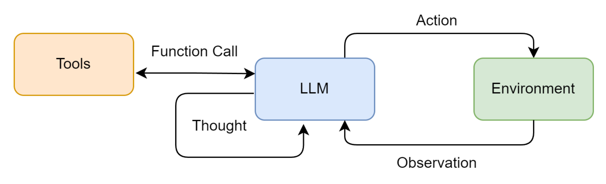

### 工具的定义与实现

工具定义要素：

1. Name名称：唯一、简洁的标识符。供智能体在Action中调用。
2. Description描述：自然语言对工具用途的描述。大模型依据描述判断何时使用此工具。
3. Execution Logic执行逻辑：真正执行任务的函数或方法。

ToolExecutor工具执行器：注册和调度多个工具的统一入口。

### ReAct智能体的编码实现

#### 核心循环

循环直到问题解决或达到设定的最大步数：

1. 格式化提示词
2. 调用LLM
3. 执行动作
4. 整合结果

#### 提示词设计REACT_PROMPT_TEMPLATE

1. 角色定义
2. 工具清单
3. 格式规约
4. 动态上下文

```python
# ReAct 提示词模板
REACT_PROMPT_TEMPLATE = """

# 1. 角色定义：设定LLM的角色。
请注意，你是一个有能力调用外部工具的智能助手。

# 2. 工具清单：告知LLM可以调用哪些工具。
可用工具如下:
{tools}

# 3. 格式规约：强制LLM进行结构性输出。方便使用代码进行意图和结果的解析。
请严格按照以下格式进行回应:

Thought: 你的思考过程，用于分析问题、拆解任务和规划下一步行动。
Action: 你决定采取的行动，必须是以下格式之一:
- `{{tool_name}}[{{tool_input}}]`:调用一个可用工具。
- `Finish[最终答案]`:当你认为已经获得最终答案时。
- 当你收集到足够的信息，能够回答用户的最终问题时，你必须在Action:字段后使用 Finish[最终答案] 来输出最终答案。

# 4. 动态上下文：注入原始问题和不断累积的交互历史，为LLM决策提供完整上下文。
现在，请开始解决以下问题:
Question: {question}
History: {history}
"""

```

#### 输出解析器

从LLM返回的纯文本中提取Thought和Action。一般由辅助解析函数使用正则表达式实现。

#### 工具调用与执行

1. 首先检测是否达到停止条件（任务完成/达到最大循环次数），若是则流程结束；
2. 将输出解析器提取出的action送入ToolExecutor工具执行器，获得对应的工具函数并执行，得到observation。

#### 整合观测结果

将Action和Observation添加至历史记录中，为下一轮循环提供新的上下文。

### ReAct智能体的优势、不足、调试方法

#### 优势

1. 可解释性高：通过Thought链，可以清晰看到智能体的决策步骤。便于理解、调试、信任智能体。
2. 动态规划与纠错能力：一步思考一步执行的执行的模式，根据Observation结果动态调整后续的Thought和Action，便于根据最新信息进行决策以及自我纠错。
3. 工具协同能力：ReAct范式天然地将LLM推理能力与外部工具执行能力结合。LLM和外部工具协同工作，突破单一LLM的知识实效性、计算准确性缺陷。

#### 不足

1. 强依赖LLM本身能力：LLM的逻辑推理能力不足容易在Thought产生错误的规划；LLM的指令遵循/格式化输出能力不足容易在Action生成不符合格式的指令导致流程中断。
2. 执行效率：完成一个任务需要多次调用LLM，完成复杂任务需要较高时间和计算资源。
3. 提示词模版的脆弱性：提示词模版的微笑改动可能对LLM输出产生重大影响；如果模型没有遵循提示词模版则输出解析器无法正常工作，整个流程无法运行。
4. 可能陷入局部最优：步进式的决策模式可能导致，缺乏全局长远规划。

#### 调试方法

1. 检查完整提示词：将包括原始问题和每一步Thought和Observation上下文的完整prompt打印，检查有无问题。
2. 分析原始输出：LLM返回的文本原始输出。
3. 检查工具函数的输入输出格式，确保满足智能体可理解（与提示词规定一致）/ parser可解析。
4. 提示词中增加示例：有助于引导模型更好遵循指令。
5. 更换能力更强的模型或者调整temperature（调低以减少多样性增加准确性）等参数。
